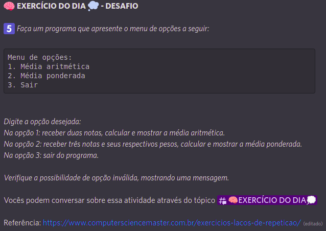

# Média Aritmética e Ponderada.

    Primeiro desafio diário, Let's Code, resolvido. Consiste no desenvolvimento de uma aplicação para realizar o cálculo e exibir a média aritmética e ponderada de respectivos valores informados pelo o usuário.

<label>
    Link:
    <a href="https://pablofilipe.github.io/media_aritmetica_ponderada/index.html" target="_blank">
        Média Aritmética e Ponderada
    </a>.
</label>

    &darr;&darr;&darr;&darr;&darr;&darr;&darr;&darr;&darr;&darr;&darr;&darr;&darr;&darr;&darr;&darr;&darr;&darr;&darr;&darr;&darr;&darr;&darr;&darr;&darr;&darr;&darr; Desafio! &darr;&darr;&darr;&darr;&darr;&darr;&darr;&darr;&darr;&darr;&darr;&darr;&darr;&darr;&darr;&darr;&darr;&darr;&darr;&darr;&darr;&darr;&darr;&darr;&darr;&darr;&darr;&darr;

    

