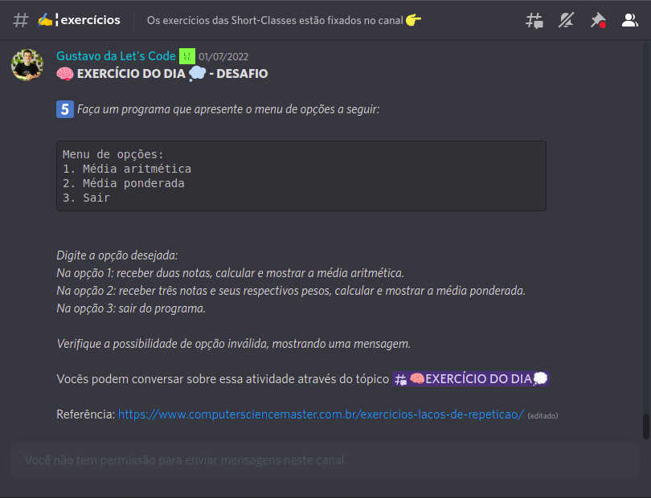

# Média Aritmética e Ponderada.
Primeiro desafio diário, Let's Code, resolvido. Consiste no desenvolvimento de uma aplicação para realizar o cálculo e exibir a média aritmética e ponderada de respectivos valores informados pelo o usuário.

&darr;&darr;&darr; Desaio &darr;&darr;&darr;

